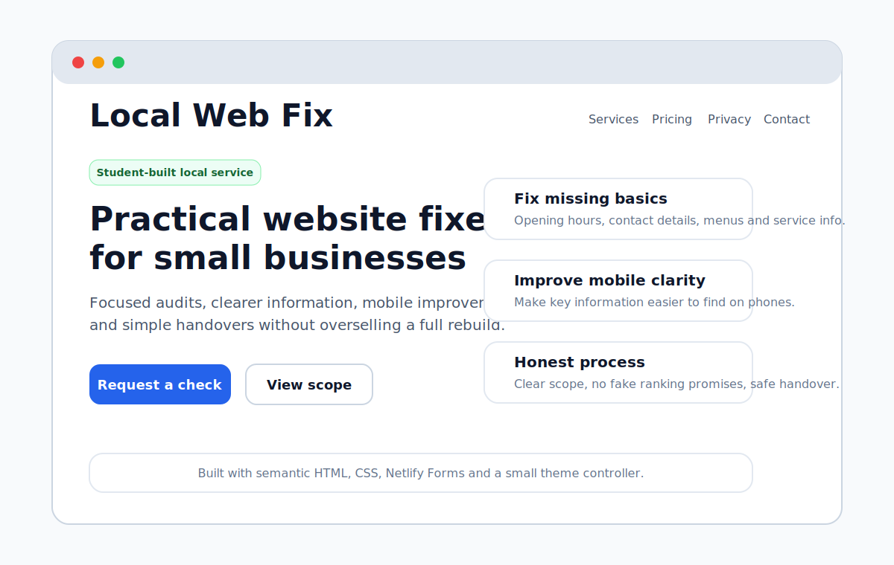

# Local Web Fix

[](https://github.com/JamieP-205/local-web-fix/actions/workflows/ci.yml)

## Live site

The service is live at [localwebfix.co.uk](https://localwebfix.co.uk/). Enquiries are delivered via Netlify Forms and followed up manually.

## Status

**Live service website** – this project is in production and used to accept enquiries from real clients.

## Summary

Local Web Fix is a focused service website offering practical website and online‑information improvements for UK local businesses. Many small businesses already have a site, Google profile, menu, booking link or social page but customers still struggle to find basic information. This site positions my service around those specific problems: opening hours, contact routes, mobile clarity, menus, prices, services and inconsistent public details. It avoids fake testimonials, ranking promises or agency‑style marketing and instead explains my scope and process clearly.

## Screenshots

| Service website preview |
| --- |
|  |

## Why I built it

I wanted to help local businesses fix the most important issues on their existing web presence without selling a full redesign they may not need. By offering targeted audits, clear handover templates and honest pricing, I can practise both technical and communication skills while studying.

## What I built

- A mobile‑first service website with light and dark themes and a persistent theme preference
- A Netlify Forms enquiry flow with required‑field validation and a honeypot field to deter bots
- Clear pricing, scope, access‑safety and privacy information on dedicated pages
- An unlisted payment page used only after a job scope is agreed
- A fictional example audit that is clearly labelled as an example
- Operating templates for audits, proposals, handovers, releases and prospect tracking in `docs/`
- A custom 404 page, sitemap, robots file, web manifest and social preview image

## Business thinking

This project forced me to think beyond code. I wrote copy that sets client expectations, created a pricing model that reflects the value of small fixes, established a safe process for accessing client sites without requesting passwords and built templates for audits and proposals. I also learned to keep the service honest: by making it clear I am a student and that I do not guarantee search‑engine rankings or oversell my capacity, I build trust instead of hype.

## Key files

- `index.html` – homepage and enquiry form
- `privacy.html` – privacy information
- `scope.html` – service boundaries and terms
- `pay.html` – unlisted scope‑confirmed payment links
- `theme.js` – persisted light/dark theme preference
- `docs/` – reusable operating templates and release notes
- `tools/check-site.js` – site and link validation script used in CI

## Technical approach

The project uses semantic HTML, CSS and a small vanilla JavaScript theme controller. There is no client‑side framework because the site does not need one. The enquiry form is handled by Netlify Forms, which stores submissions and sends email notifications. The form never asks for passwords or account credentials. If later work needs access, the process uses limited collaborator or manager permissions where the platform supports them.

## Local development

```bash
npm install
npm test
npx serve .
```

No build step is required. `npm test` checks JavaScript syntax, required files, metadata, local links and the Netlify form configuration.

## Deployment checks

After a Netlify deployment I:

1. Submit a test enquiry
2. Confirm it appears in Netlify Forms
3. Verify the email notification
4. Check the main information pages and a missing URL
5. Confirm the payment page remains outside public navigation

## Privacy & safety notes

The service never stores or asks for passwords. All `.env` files and secrets are excluded from the repository. See [SECURITY.md](SECURITY.md) for vulnerability reporting and [CONTRIBUTING.md](CONTRIBUTING.md) for project rules.

## What I learned

By building Local Web Fix I learned how to scope and price a service, communicate limitations transparently, and design a simple website that gets clients to the enquiry stage without friction. I also gained practice in writing privacy policies, managing Netlify Forms, and thinking through client handover and access safety.

## Future improvements

- Collect anonymous feedback after each completed job to improve the service
- Automate audit generation based on a checklist of common issues
- Add a FAQ section addressing typical client questions about process and scope
- Explore offering monthly monitoring as an optional add‑on

