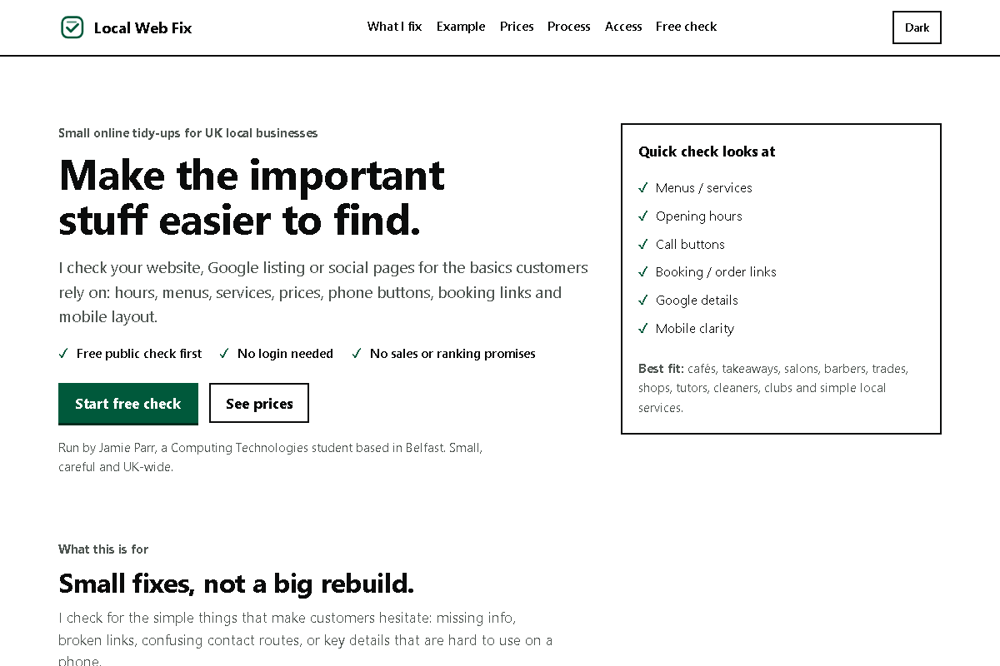

# Local Web Fix

[](https://github.com/JamieP-205/local-web-fix/actions/workflows/ci.yml)

Live at [localwebfix.co.uk](https://localwebfix.co.uk/).

A small service site. Local businesses send me a link to their website, Google listing or Facebook page, and I check whether a customer can actually find the basics: opening hours, the menu, a phone number that works on a phone, a booking link that is not dead.



## Why I built it

Most small businesses do not need a rebuild. They need the four things customers look for to be correct and findable. Nobody sells that, because it is not worth much money, so shops get quoted for a full site instead. This is my attempt at offering the small version honestly, while I am still a student and cheap.

## The site is the easy part

It is HTML, CSS and a theme toggle. The work went into the wording:

- **Pricing is on the page.** Free check, then £50, £100 or £150 with what each includes. No "contact us for a quote".
- **The scope page says what I will not do.** No SEO campaigns, no payment systems, no plugin surgery. If someone else manages the site, I say so and hand over notes instead.
- **No passwords, ever.** The first check uses public links only. If a fix needs access later, it goes through proper collaborator or manager permissions. I am a student, and I should not be holding the logins to somebody's livelihood.
- **The example check is labelled fictional**, because it is. It stays that way until a real business is happy for me to publish theirs.

## Files

- `index.html` the whole pitch, and the enquiry form
- `scope.html` what is and is not included
- `privacy.html` what happens to what people send me
- `pay.html` payment links, unlisted and `noindex`, only sent once a scope is agreed
- `theme.js` light/dark toggle, saved in localStorage
- `docs/` templates I use for the actual work: audits, proposals, handovers
- `tools/check-site.js` the checks CI runs

## Running it

```bash
npm install
npm test
npx serve .
```

No build step. `npm test` parses the JavaScript, then checks the required pages exist, the local links resolve with the right casing, and the enquiry form still has the Netlify attributes on it. That last check exists because the form is the only thing on the site that matters, and it is one attribute away from silently not submitting.

## Gotchas

- The form is Netlify Forms, so it only works on a Netlify deploy. It does nothing on `npx serve`.
- Reaching the thanks page does not prove an email went out. Netlify stores the submission either way. Email notifications are configured separately in the Netlify dashboard, which I found out the annoying way.
- `pay.html` is deliberately not in the navigation or the sitemap. Do not link it.

## Next

- A real example report, once a client is happy for me to publish one
- Feedback after a finished job, so I have something better than my own opinion of how it went
